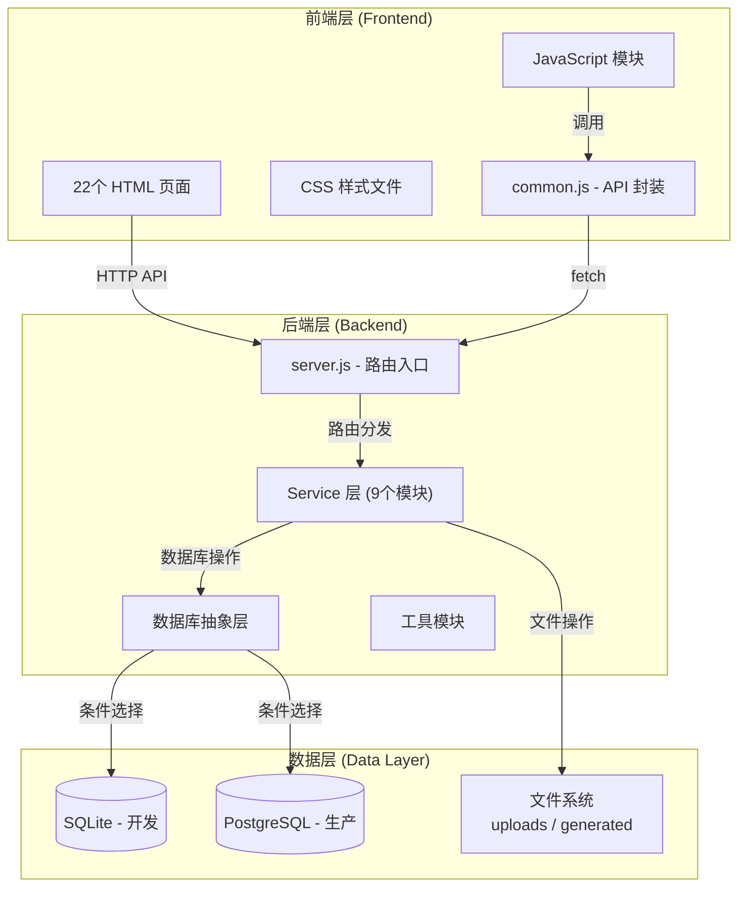
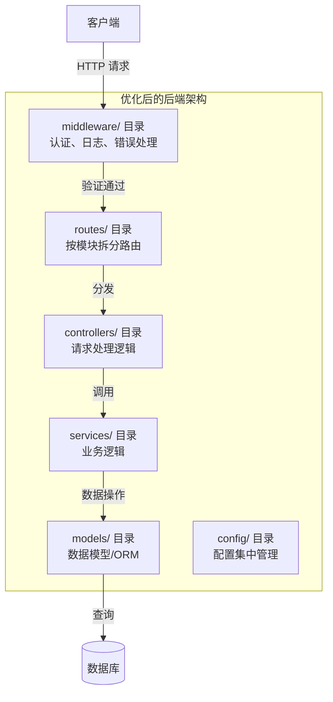
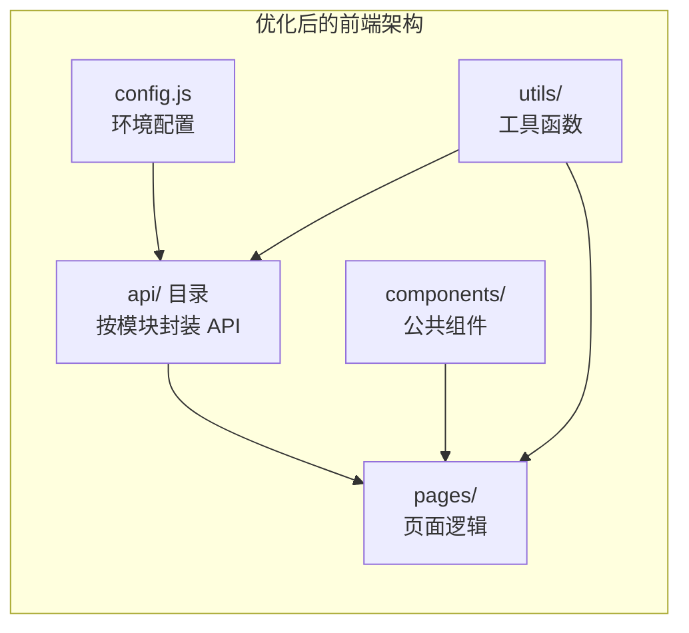

# Auyologic GEO 平台 - 架构审查报告

## 一、项目概述

**项目名称**: Auyologic GEO 智能营销后台  
**技术栈**: Node.js + Express + SQLite/PostgreSQL + 原生 HTML/CSS/JS  
**功能模块**: 22 个页面，涵盖 GEO 检测、品牌监控、知识库、文章生成等

---

## 二、当前架构图



---

## 三、架构优势

| 优势 | 说明 |
|------|------|
| ✅ **技术栈简洁** | 无复杂框架，学习成本低，维护简单 |
| ✅ **数据库双模式** | SQLite/PostgreSQL 切换，开发部署灵活 |
| ✅ **模块化服务层** | 9 个独立 Service，职责清晰 |
| ✅ **静态前端** | 无需构建步骤，部署简单，Agent 友好 |
| ✅ **文件解析能力** | 支持 PDF/DOCX/TXT 解析，知识库功能完整 |

---

## 四、架构问题与风险

### 4.1 后端架构问题

| 问题 | 严重程度 | 说明 |
|------|----------|------|
| 🔴 **路由集中化** | 高 | server.js 1112 行，所有路由在一个文件，难以维护 |
| 🔴 **缺少中间件层** | 高 | 无统一认证中间件，每个路由单独处理 |
| 🟡 **错误处理不一致** | 中 | 部分路由 try-catch，部分缺少错误处理 |
| 🟡 **缺少请求验证** | 中 | 无统一参数校验，依赖手动检查 |
| 🟡 **日志记录简单** | 低 | 仅使用 morgan，缺少业务日志 |

### 4.2 前端架构问题

| 问题 | 严重程度 | 说明 |
|------|----------|------|
| 🔴 **API 地址硬编码** | 高 | [`API_BASE_URL`](auyologic-final/frontend/js/common.js:6) 写死 localhost:3000 |
| 🟡 **代码复用度低** | 中 | 各页面独立 HTML，公共组件抽离不足 |
| 🟡 **状态管理缺失** | 中 | 页面间数据传递依赖 localStorage/URL |
| 🟡 **缺少构建流程** | 低 | 无法进行代码压缩、Tree Shaking |

### 4.3 数据层问题

| 问题 | 严重程度 | 说明 |
|------|----------|------|
| 🔴 **缺少数据库迁移** | 高 | 表结构变更需要手动执行 SQL |
| 🟡 **无连接池管理** | 中 | SQLite 单连接，高并发可能成为瓶颈 |
| 🟡 **缺少索引优化** | 中 | 未分析查询性能，缺少索引 |

### 4.4 部署与运维问题

| 问题 | 严重程度 | 说明 |
|------|----------|------|
| 🟡 **环境配置分散** | 中 | .env 在不同目录，配置项不统一 |
| 🟡 **缺少健康检查** | 中 | 仅简单 /health 端点 |
| 🟡 **缺少监控告警** | 低 | 无性能监控和异常告警机制 |

---

## 五、改进方案

### 5.1 后端架构优化



#### 具体改进措施：

1. **路由模块化拆分**
   ```
   backend/routes/
   ├── index.js          # 路由入口
   ├── articles.js       # 文章路由
   ├── auth.js           # 认证路由
   ├── brand.js          # 品牌路由
   ├── geo.js            # GEO检测路由
   ├── knowledge.js      # 知识库路由
   └── ...
   ```

2. **添加中间件层**
   ```
   backend/middleware/
   ├── auth.js           # JWT 认证中间件
   ├── errorHandler.js   # 全局错误处理
   ├── validator.js      # 请求参数验证
   └── logger.js         # 业务日志
   ```

3. **统一响应格式**
   ```javascript
   // 统一 API 响应格式
   {
     success: boolean,
     data?: any,
     error?: {
       code: string,
       message: string,
       details?: any
     },
     meta?: {
       timestamp: string,
       requestId: string
     }
   }
   ```

### 5.2 前端架构优化



#### 具体改进措施：

1. **API 层模块化**
   ```javascript
   // frontend/js/api/index.js
   const API_BASE_URL = window.location.hostname === 'localhost' 
     ? 'http://localhost:3000/api' 
     : '/api';
   
   // frontend/js/api/articles.js
   export const ArticleAPI = {
     getAll: () => fetch(`${API_BASE_URL}/articles`),
     generate: (data) => fetch(`${API_BASE_URL}/articles/generate`, { method: 'POST', body: JSON.stringify(data) }),
     // ...
   };
   ```

2. **组件化提取**
   - 提取通用表格组件
   - 提取表单验证组件
   - 提取通知/弹窗组件

3. **环境配置分离**
   ```javascript
   // frontend/js/config.js
   const config = {
     development: {
       apiBaseUrl: 'http://localhost:3000/api',
       enableDebug: true
     },
     production: {
       apiBaseUrl: '/api',
       enableDebug: false
     }
   };
   ```

### 5.3 数据库架构优化

1. **引入数据库迁移工具**
   - 使用 `node-pg-migrate` 或自建迁移系统
   - 版本化管理表结构变更

2. **添加 ORM/查询构建器**
   - 可选：Knex.js（轻量，支持 SQLite/PostgreSQL）
   - 或保持原生 SQL，但封装查询构建器

3. **性能优化**
   ```sql
   -- 添加常用查询索引
   CREATE INDEX idx_articles_status ON articles(status);
   CREATE INDEX idx_articles_created ON articles(created_at);
   CREATE INDEX idx_kb_docs_category ON kb_documents(category);
   ```

---

## 六、优先级实施计划

### 阶段 1：基础架构优化（高优先级）

| 任务 | 预计时间 | 影响范围 |
|------|----------|----------|
| 拆分 server.js 路由 | 2-3 天 | 后端 |
| 创建中间件层 | 1-2 天 | 后端 |
| API 地址配置化 | 0.5 天 | 前端 |
| 统一错误处理 | 1 天 | 后端 |

### 阶段 2：代码质量提升（中优先级）

| 任务 | 预计时间 | 影响范围 |
|------|----------|----------|
| 数据库迁移系统 | 2-3 天 | 数据层 |
| API 模块化封装 | 1-2 天 | 前端 |
| 添加请求验证 | 1-2 天 | 后端 |
| 提取公共组件 | 2-3 天 | 前端 |

### 阶段 3：可观测性增强（低优先级）

| 任务 | 预计时间 | 影响范围 |
|------|----------|----------|
| 日志系统完善 | 1-2 天 | 后端 |
| 性能监控 | 2-3 天 | 全栈 |
| 健康检查增强 | 0.5 天 | 后端 |

---

## 七、风险与注意事项

| 风险 | 缓解措施 |
|------|----------|
| 重构引入新 Bug | 保持原有功能测试，渐进式重构 |
| 数据库迁移失败 | 迁移前完整备份，支持回滚 |
| API 地址变更影响部署 | 使用相对路径或环境变量 |
| 团队学习成本 | 文档先行，代码审查 |

---

## 八、总结

当前 Auyologic 项目架构**满足现有功能需求**，但在**可维护性、扩展性和代码规范**方面存在改进空间。建议按优先级逐步实施改进方案，优先解决路由集中化和 API 硬编码问题，再逐步完善其他架构层。

**核心建议**：
1. 🔴 **立即处理**：路由拆分、API 配置化
2. 🟡 **近期处理**：中间件层、数据库迁移
3. 🟢 **远期优化**：组件化、性能监控

---

*报告生成时间: 2026-03-14*  
*基于代码库 commit: 需要补充*
